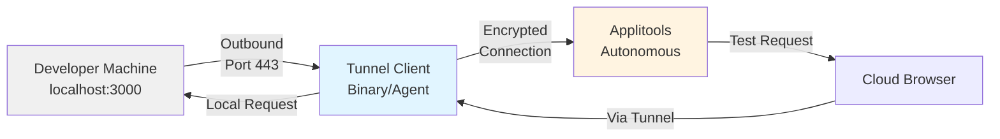
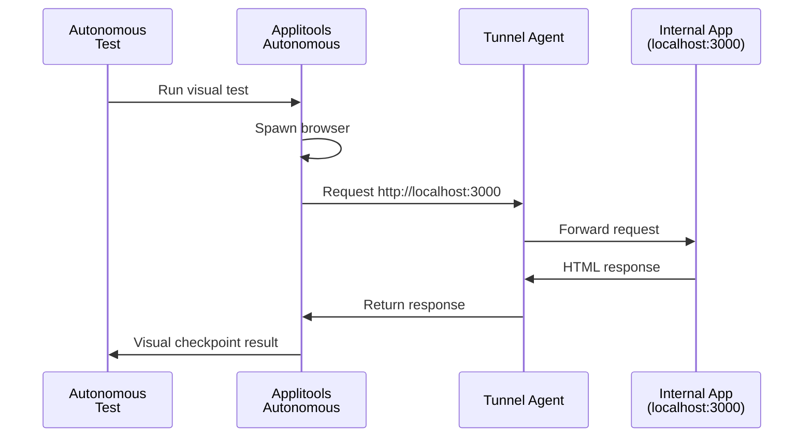
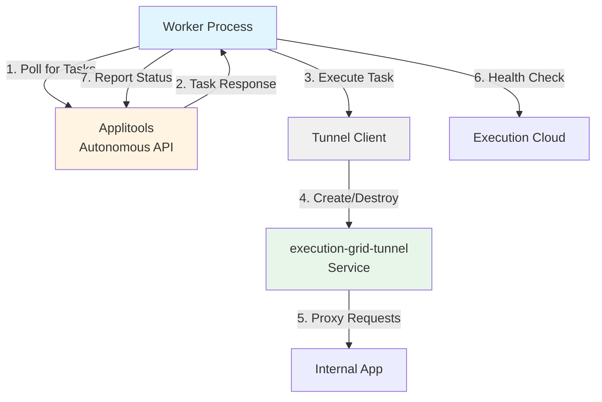
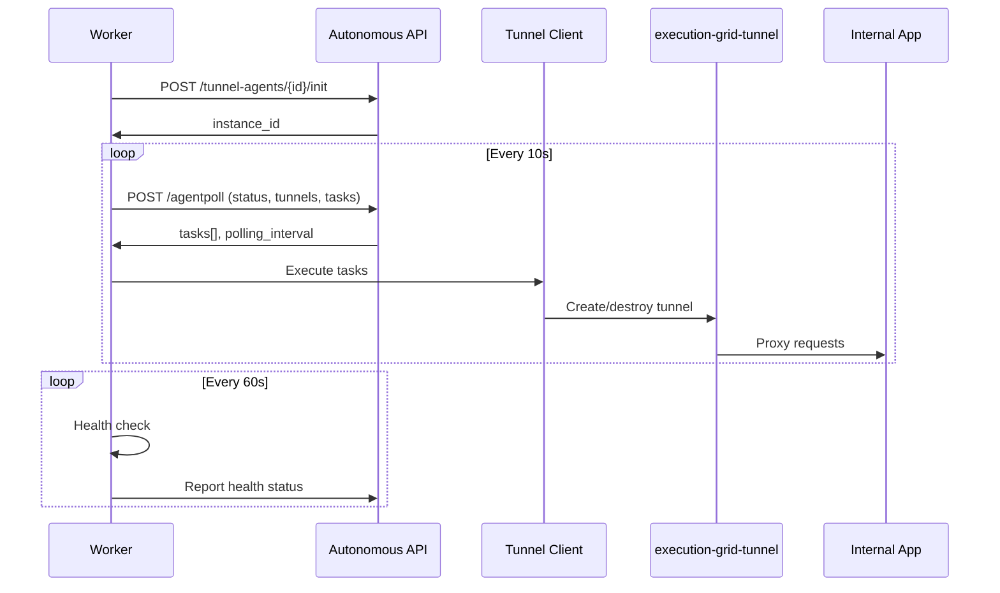

# @applitools/tunnel-client

The on-premises agent binary that enables Applitools Autonomous to securely access web applications running on local machines, staging environments, or behind corporate firewalls during visual testing.


## AI disclaimer

HUGE parts of this document are AI generated.
USE WITH CAUTION

## Quick Start

1. **Configure tunnel** in Applitools Autonomous platform settings
2. **Download binary** for your platform (Linux/macOS/Windows)
3. **Run the command** provided by Applitools:
   ```bash
   ./tunnel-client-linux --pollingServerUrl <url> --secret <secret> --agentId <id>
   ```
4. **Verify connection** in the Applitools dashboard (status should show "Connected")
5. **Run tests** using the tunnel name configured in step 1

## Overview

When testing applications with Applitools, the cloud-based browsers and AI services need to access your application. This works seamlessly for public URLs, but applications on `localhost`, internal staging servers, or behind VPNs are not directly accessible from the cloud.

**The tunnel-client solves this problem** by running as an agent on your internal network, establishing an encrypted outbound connection (reverse proxy) to the Applitools Execution Cloud. This allows cloud browsers to "see" and interact with your internal applications as if they were on the same network.



### Key Characteristics

- **Outbound-only connection**: Initiates connection from your network to Applitools (Port 443), requiring no inbound firewall rules
- **Reverse proxy**: Cloud requests are routed through the tunnel to your internal applications
- **Encrypted**: All traffic protected with TLS/SSL (2048-bit RSA, 256-bit AES)
- **Zero-trust**: The agent only routes packets; it never inspects or stores application data

### Supported Regions

The tunnel-client supports three Applitools regions:

| Region | Execution Cloud URL | Use When |
|--------|---------------------|----------|
| **us-west** (default) | https://exec-wus.applitools.com | North America, default region |
| **australia-southeast** | https://exec-au.applitools.com | Australia, Asia-Pacific |
| **singapore** | https://exec-sgp.applitools.com | Singapore, Southeast Asia |

### Network Requirements

For corporate networks with restrictive egress policies, ensure outbound access to your region's Execution Cloud:

| Requirement | Value |
|-------------|-------|
| **Port** | 443 (HTTPS) |
| **Protocol** | TLS 1.2 or higher |
| **DNS** | Region-specific (see table above) |

The tunnel requires **outbound** access only. No inbound ports need to be opened.

## When to Use

Use the tunnel-client when your application under test is:
- Running on `localhost` or `127.0.0.1` during development
- Hosted on internal staging/QA servers behind firewalls or VPNs
- Accessible only from corporate networks
- Behind geo-restrictions or IP allowlists

**Don't need a tunnel?** If your application is publicly accessible (e.g., `https://staging.example.com`), you can test directly without a tunnel.

## Usage

### Running the Binary (Primary Use Case)

The tunnel-client is typically distributed and run as a platform-specific standalone binary:

```bash
# Linux/macOS
./tunnel-client-linux --pollingServerUrl https://exec.applitools.com --secret <your-secret> --agentId <your-agent-id>

# Windows
tunnel-client-win.exe --pollingServerUrl https://exec.applitools.com --secret <your-secret> --agentId <your-agent-id>
```

**In typical usage:**
1. Configure your tunnel in the Applitools Autonomous platform settings
2. The platform generates a unique command with credentials
3. Run the binary on a machine within your internal network
4. The agent establishes an outbound connection and remains active
5. Autonomous cloud browsers can now access your internal application via the tunnel



See the Applitools Autonomous platform for tunnel configuration and setup commands.

#### CLI Options

- `--pollingServerUrl` (required): Applitools Execution Cloud endpoint
- `--secret` (required): Authentication token (from Applitools platform)
- `--agentId` (required): Unique tunnel identifier
- `--version`: Show version number
- `--help`: Show help

#### Environment Variables

| Variable | Purpose | Default | Example |
|----------|---------|---------|---------|
| `APPLITOOLS_EG_TUNNEL_LOG_LEVEL` | Log verbosity | `all` | `all`, `info`, `error` |
| `APPLITOOLS_EG_TUNNEL_LOG_FILES_DIRECTORY` | Log directory | `./logs` | `/var/log/tunnel` |
| `APPLITOOLS_EC_TUNNEL_USE_FRP` | Enable FRP mode (deprecated) | `false` | `true` |
| `APPLITOOLS_EG_TUNNEL_MANAGER_URL` | Override Execution Cloud URL | Region-based | `https://exec-wus.applitools.com` |
| `NODE_TLS_REJECT_UNAUTHORIZED` | TLS validation (auto-set by CLI) | `0` | `0` or `1` |

### Programmatic API (Internal Use Only)

The programmatic API is primarily for internal Applitools use. All external consumers should use the binary. For internal development:

```typescript
import {makeTunnelClient} from '@applitools/tunnel-client'

const client = makeTunnelClient({
  settings: {region: 'us-west'},
  logger: myLogger,
})

await client.close()
```

## Binary vs JS Entry Point

The tunnel-client is distributed in two forms for different deployment scenarios:

### 1. Single Executable Application (SEA) Binary (Recommended)

Platform-specific standalone binaries in `bin/`:
- `bin/tunnel-client-linux` - Linux x64 executable
- `bin/tunnel-client-darwin` - macOS ARM64/x64 executable
- `bin/tunnel-client-win.exe` - Windows x64 executable

**Advantages:**
- No Node.js installation required
- Smaller distribution size
- Faster startup time
- Self-contained with all dependencies

**When to use:**
- Distributing to end users or CI environments
- Docker containers without Node.js
- Standalone installations

**Launching programmatically:**

```javascript
const {spawn} = require('child_process')
const agent = spawn('./bin/tunnel-client-linux', [
  '--pollingServerUrl', 'https://autonomous-api.applitools.com',
  '--secret', process.env.TUNNEL_SECRET,
  '--agentId', 'my-tunnel-agent'
], {
  stdio: 'inherit'
})

agent.on('exit', (code) => {
  console.log(`Tunnel agent exited with code ${code}`)
})
```

⚠️ **Important:** Use `spawn()` for binaries, NOT `fork()`. See [docs/ForkVsSpawn.md](./docs/ForkVsSpawn.md).

### 2. JavaScript Entry Point

The compiled JavaScript entry point: `dist/cli/cli.js`

**When to use:**
- Node.js is already available
- Need `fork()` for IPC communication
- Development/debugging scenarios

**Launching programmatically:**

```javascript
const {fork} = require('child_process')
const agent = fork(require.resolve('@applitools/tunnel-client/dist/cli/cli.js'), [
  '--pollingServerUrl', 'https://autonomous-api.applitools.com',
  '--secret', process.env.TUNNEL_SECRET,
  '--agentId', 'my-tunnel-agent'
])
```

**See also:** [docs/ForkVsSpawn.md](./docs/ForkVsSpawn.md) for detailed technical explanation.

## Architecture

The tunnel-client uses a **polling-based architecture** with self-healing capabilities:



### Components

1. **Worker** (`src/worker.ts`): Main process that polls for tasks and manages lifecycle
2. **Generator** (`src/generator.ts`): Async generator for polling and task distribution
3. **Client** (`src/client.ts`): API for tunnel lifecycle (create, destroy, list, replace)
4. **execution-grid-tunnel**: Underlying TCP/FRP service that proxies network traffic
5. **CLI** (`src/cli/cli.ts`): Entry point for standalone binary execution

### How It Works

**Polling Loop:**
1. Worker initializes with agentId and secret
2. Polls Applitools API every 10 seconds (configurable)
3. Receives tasks: CREATE_TUNNEL, DELETE_TUNNEL, REPLACE_TUNNEL, GET_RESOURCE
4. Executes tasks using the tunnel client
5. Reports task completion status back to the API
6. Performs health checks every 60 seconds

**Task Types:**
- `CREATE_TUNNEL`: Establish new tunnel with Eyes credentials
- `DELETE_TUNNEL`: Close and cleanup tunnel
- `REPLACE_TUNNEL`: Recreate tunnel (useful for connection issues)
- `GET_RESOURCE`: Fetch resources through the tunnel

**Self-Healing:**
- Unhandled errors trigger automatic worker restart with exponential backoff
- Failed tunnel creation attempts retry with increasing delays
- Network failures during polling restart the session
- Consecutive failures are tracked and reported for diagnostics

### Process Flow




## Tunnel Modes

The tunnel-client supports two connection modes:

### TCP Tunnel (Default, Recommended)

The modern, high-performance tunnel implementation:
- **Default behavior**: Automatically used unless FRP mode is explicitly enabled
- **Performance**: Lower latency, better throughput
- **Reliability**: Improved connection stability

### FRP Tunnel (Legacy, Deprecated)

The older Fast Reverse Proxy implementation:
- **Status**: Deprecated, will be removed in future versions
- **Enable**: Set `APPLITOOLS_EC_TUNNEL_USE_FRP=true`
- **Warning**: A deprecation warning will be logged when using FRP mode

**Recommendation**: Use the default TCP tunnel mode. Contact support@applitools.com if you need FRP mode.

## Configuration Options

**For CLI usage:**

```typescript
interface TunnelClientWorkerSettings {
  pollingServerUrl: string       // Applitools polling server URL
  secret: string                 // Authentication secret from Applitools
  agentId: string                // Unique agent/tunnel identifier
  region?: 'us-west' | 'australia-southeast' | 'singapore'
  pollingTimeout?: number        // Polling interval in ms (default: 10000)
  timeout?: number               // Connection timeout in ms (default: 300000)
  ecHealthCheckInterval?: number // Health check interval in ms (default: 60000)
}
```

**For programmatic API:**

```typescript
interface TunnelClientSettings {
  serviceUrl?: string  // Custom service URL (testing only)
  region?: 'us-west' | 'australia-southeast' | 'singapore'
}
```

## Reliability Features

The tunnel-client is designed for **long-running stability** in CI/CD environments and development machines:

### Automatic Retry with Exponential Backoff

**Tunnel creation retries** (when concurrency limits are hit):
- First 5 attempts: 2-second delays (10 seconds total)
- Next 4 attempts: 5-second delays (20 seconds total)
- Subsequent attempts: 10-second delays

**Worker restart backoff** (on crashes):
- Exponential backoff: `min(2 minutes, 1000ms * 2^consecutiveFailures)`
- Automatically restarts after unhandled errors
- Resets backoff on successful tunnel creation

### Self-Healing

- **Network interruptions**: Automatic reconnection when connectivity is restored
- **Unhandled errors**: Worker catches unhandled rejections and uncaught exceptions, then restarts
- **Graceful shutdown**: Proper cleanup on termination signals
- **Health monitoring**: Continuous health checks every 60 seconds (configurable)

### Continuous Operation

For production/CI environments:
- **Run multiple agents**: Deploy multiple tunnel agents for the same tunnel definition (high availability)
- **System service**: Start as a daemon/service for automatic startup
- **Log monitoring**: Logs written to rolling files in `APPLITOOLS_EG_TUNNEL_LOG_FILES_DIRECTORY` (default: `./logs`)
- **Error reporting**: Automatic error reporting to Coralogix for diagnostics

### Health Checks

The agent performs periodic health checks to verify:
1. **Connectivity**: Can reach the Execution Cloud
2. **Tunnel status**: Active tunnels are functioning
3. **System resources**: CPU, memory usage metrics

Default health check interval: 60 seconds (configurable via `ecHealthCheckInterval`)

**See also:** [docs/NetworkIssues.md](./docs/NetworkIssues.md) for debugging network failures.

## Development

### Building

```bash
# Build TypeScript
yarn build

# Build binaries (requires platform-specific setup)
yarn build:bin:zip
yarn build:bin:tgz
```

### Testing

```bash
# Run all tests
yarn test

# Run specific test groups
yarn test:bin    # Binary tests
yarn test:cli    # CLI tests
yarn test:it     # Integration tests
```

### Project Structure

```
tunnel-client/
├── bin/              # Platform-specific binaries
├── dist/             # Compiled JavaScript
├── docs/             # Documentation
├── src/              # TypeScript source
│   ├── cli/          # CLI entry point
│   ├── client.ts     # Main client API
│   ├── worker.ts     # Worker implementation
│   ├── generator.ts  # Tunnel creation logic
│   └── types.ts      # TypeScript types
├── test/             # Test files
└── types/            # Generated type definitions
```

## Common Issues

### Tunnel shows "Inactive" or "Disconnected" in Applitools Dashboard

**Possible causes:**
- Binary is not running on the internal machine
- Firewall blocking outbound Port 443 to 34.49.100.3
- Network connectivity issues
- Incorrect credentials (secret or agentId)

**Solution:**
1. Verify the binary process is running: `ps aux | grep tunnel-client`
2. Check logs in `APPLITOOLS_EG_TUNNEL_LOG_FILES_DIRECTORY`
3. Test outbound connectivity: `curl https://exec-wus.applitools.com`
4. Verify firewall allows HTTPS to 34.49.100.3:443

### Binary shows help instead of running (SDK Integration Issue)

**Symptom:** When launching the binary programmatically, it shows usage/help text.

**Cause:** Using `child_process.fork()` with a binary executable instead of `spawn()`.

**Solution:** Use `spawn()` for binaries, or use the JS entry point (`dist/cli/cli.js`) with `fork()`.

See: [docs/ForkVsSpawn.md](./docs/ForkVsSpawn.md) for technical explanation

### Tests fail with "Cannot reach localhost"

**Symptom:** Tests fail to reach the application, even though tunnel is connected.

**Possible causes:**
- Application not running on the expected port
- Hostname mapping not configured in Applitools platform
- Tunnel agent running on different machine than the application

**Solution:**
- Verify application is accessible from the tunnel agent machine
- Ensure tunnel agent is on the same machine (or network) as the application
- Check hostname configuration in Applitools tunnel settings

## Logging

The tunnel-client uses `@applitools/logger` with rolling file logs for comprehensive diagnostics:

**Log Locations:**
- **Console**: stdout/stderr for real-time monitoring
- **Rolling files**: `${APPLITOOLS_EG_TUNNEL_LOG_FILES_DIRECTORY}/tunnel-client-*.log`
- **Default directory**: `./logs` (relative to working directory)

**Log Features:**
- Automatic log rotation to prevent disk space issues
- Sensitive data masking (API keys, secrets, URLs)
- Structured logging with timestamps and levels
- Separate logs for tunnel-client and execution-grid-tunnel

**Example log output:**
```
[2026-02-04T10:15:23.123Z] [tunnel-client] INFO: Tunnel agent initialized with id: abc123
[2026-02-04T10:15:24.456Z] [tunnel-client] LOG: Tunnel ID: xyz789
[2026-02-04T10:15:25.789Z] [execution-grid-tunnel] INFO: TCP tunnel listening on port 12345
```

**Troubleshooting:**
- Check logs for error messages and stack traces
- Logs include network request/response details
- Errors are automatically reported to Coralogix for Applitools support analysis

**For programmatic use:**
```typescript
import {makeLogger} from '@applitools/logger'

const client = makeTunnelClient({
  logger: makeLogger({level: 'all'}),
})
```

## Documentation

- [What the tunnel client is all about](./docs/What%20the%20tunnel%20client%20is%20all%20about.md) - Comprehensive overview
- [Fork vs Spawn](./docs/ForkVsSpawn.md) - spawn() for binaries, fork() for JS
- [Network Issues](./docs/NetworkIssues.md) - Debugging connectivity problems

## Changelog

See [CHANGELOG.md](./CHANGELOG.md) for version history.
